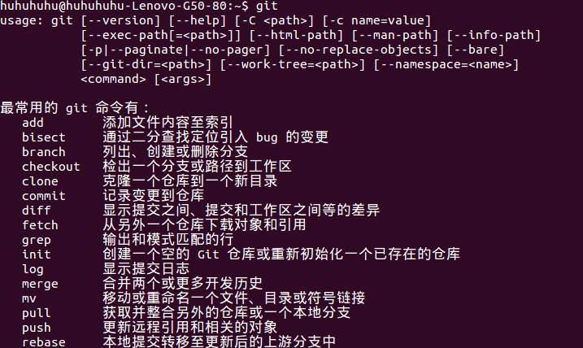
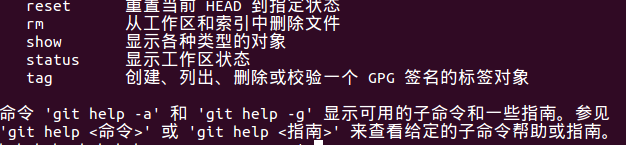
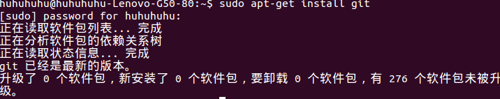
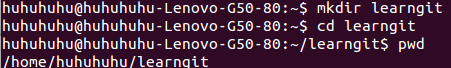
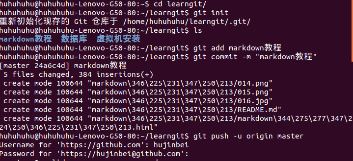
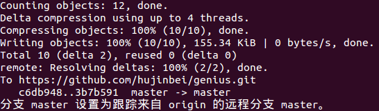
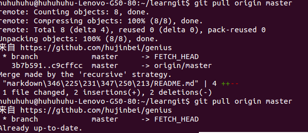
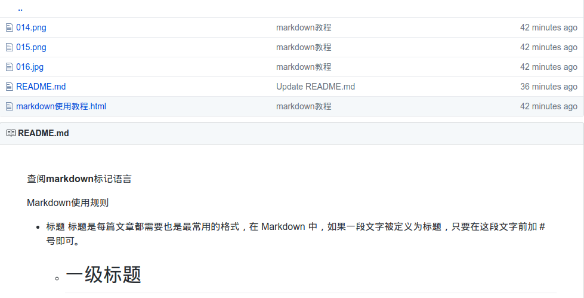
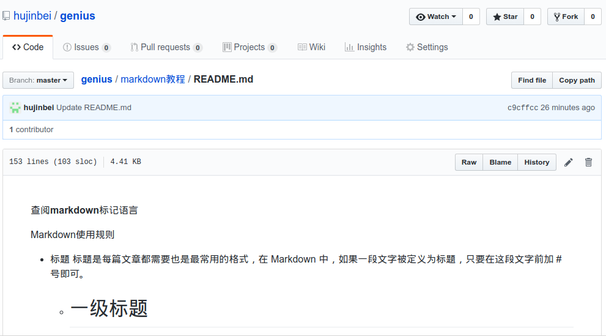
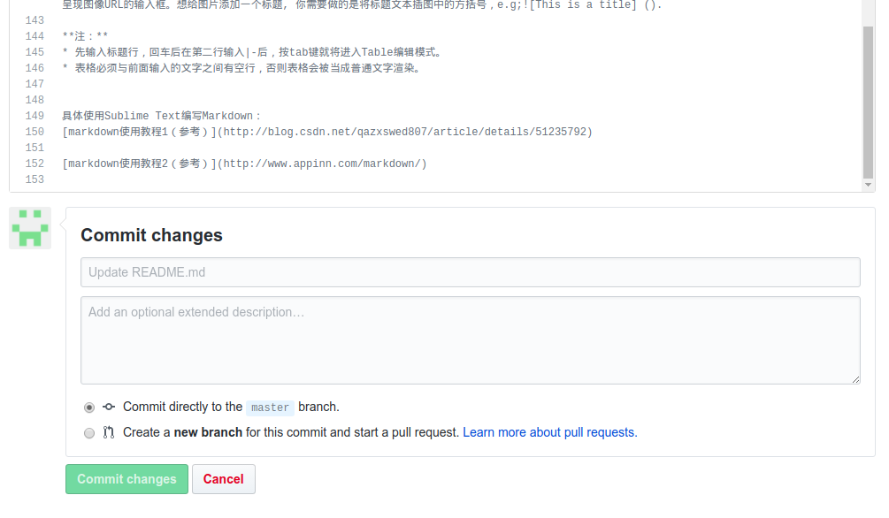

# 如何在Ubunttu14.04上使用Github
### 一、首先进入[Github官方网站](https://github.com/)，点击右上角的sign in。

** 1.注册一个新的git账号（create an account），然后建立一个新的仓库；**

* 进入界面单机下方的"create an account",然后进入注册页面开始编辑用户名，邮箱等信息，信息不允许重复存在。

* 输入用户名，和你的用户名邮箱，并设置合适的密码，用户名只能由数字、文字和英文字母组成。邮箱格式为×××××@×××.com。设置完成后点击“Create an account”；

* 然后进入标题为“Welcome to Github”的设置页面，这里你可以选择付费的版本和免费的公测版本，这里我选择的是第一个"Unlimited public repositories for free"的免费版本。以下连个两个选项的项目可以自己决定时候选择（点击前面的方框打钩为选择）,设置完成后点击“Continue”进行后续的设置；

* 接着进入“Contributions”进行设置，根据个人的偏好设置即可；

* 你可以在下面这个网页中设置自己的公共信息，比如你的姓名，邮箱，公司等等信息。

* 在主页面中的右边，单击绿色的“New repositories”,然后根据提示设置自己的仓库名字，并对此仓库进行简单的描述，然后“Create repository”，仓库就新建成功了，以后需要上传的资料就可以放置在这个仓库中；

###　二、如何在电脑上安装 Git

**１、仓库建立好之后，再打开终端，输入“ $ git ” 命令,查看电脑上是否已经安装了git，若出现一下的命令提示，则证明电脑已安装git；**

* 若是没有安装成功就在终端输入”sudo apt-get install git“（此代码仅限Ubuntu Linux和Debian使用），因为我已安装，所以出现的是没有新安装任何软件包，安装成功后再次输入"$ git"就会出现上面的命令提示了；

### 三、如何上传文件
**１、首先需要创建一个版本库用来存放上传于github的markdown文件。在终端输入” $ mkdir learngit “，然后输入” $ cd learngit “,再输入"pwd /home/huhuhuhu/learngit"(pwd为显示当前的目录，仓库文件夹的路径)；**

**3、首先将所要上传的文件或文件夹放入刚才创建的“learngit”库中，并将需要显示的.md文件重命名为“README.md”，然后打开终端输入“$ cd learngit/”命令，打开这个文件夹，在输入“git init”会初始化现存的git仓库或者会添加一个“.git”的目录，， .git 目录是用来跟踪管理版本库的，所以里面的文件不能胡乱修改，不然可能导致git库被破坏，一般 .git目录是隐藏的，输入”$ ls -ah “命令或“ctrl+h”可以查看。接着输入“ls”查看库文件夹中的内容（文件夹和文件），输入“git add markdown教程（需要上穿的文件夹名称，如果是文件直接输入文件名+后缀名即可）”，接着在输入命令 “$ git commit -m ”对这个上传文件的描述“ ” ,接着就是他上传的过程的记录了，上传后在输入”$ git push -u origin master“命令，输入github的注册用户名回车后在输入密码，一个文件就上传成功了；**

* 若上传过程中出现push错误，是因为远程库和本地库中的文件不一致，可根据提示输入”$ get pull origin master “命令，然后”Ctrl+O“快捷键，然后回车，之后在”Ctrl+X“就可以解决了，再重新输入"$ git push -u origin master"命令就可以重新上传了；

* 当有无法合并路径的错误出现时，再次输入"$ get pull origin master"命令，出现错误提示"pull不可用，尚有未合并的文件“，根据错误解决方案在终端输入"git commit -a"回车，然后重新输入$ get pull origin master"命令,若出现了上一个错误，则按照上面的教程解决问题，接着输入 $ git push -u origin master 命令，继续输入用户名和密码就能成功上传了；

* 上传成功后就可以在github中页中新建的库里面查看了，点击库名进入库中查看已上传的文件，然后点击想看的文件就行了；

* 如果发现错误可以点击”README.md0文件“，在文章的顶部,单击 笔 的标志，就可以修改了，修改完成后在页面底部点击绿色的”Commit changes“就可以保存修改了；

