# HTML学习记录
** 一个网页主要包含文本内容、对其他文件的引用和标记这三个部分；**

* 文本内容：用于给访问者了解网页内容的纯文字；

* 使用这些引用来加载图像、音频、视频文件,以及样式表(控制页面的显示效果)和 JavaScript 文件(为页面添加行为)对其他HTML的页面和资源进行引用；

* 标记：描述文本内容并确保引用正确地工作。

(HTML一词中的字母 M 就代表标记。)
p 元素用于段落, <br>abbr 元素用于缩略词,
li 元素用于列表项目。

** DOCTYPE 、 html 、 head 和body 元素是网页的基础。**

在这个页面中,可以定制的内容包括两项,一是赋予 lang 属性的语言代码,二是 < title > 和 < /title > 之间的文字。
访问者看到的内容位于主体(body) 部 分( 即 < body> 和 < /body> 之 间 的部分)。

```javascript

<!DOCTYPE html>
<html lang="en">
<head>
<meta charset="utf-8" />
<title>Your page title</title>
</head>
<body>
</body>
</html>

```

** HTML 使用 < 和 > 包围 HTML 标签。**

* 开始标签(如 < head> )用于标记元素的开始,<body>开始标签以上的内容都是为浏览器和搜索引擎准备的。

* 结 束 标 签( 如 < /head> ) 用于标记元素的结束,有的元素没有结束标签,如 meta。

*  <!DOCTYPE html> 部分( 称为DOCTYPE)告诉浏览器这是一个 HTML5 页面。
 DOCTYPE 应该始终位于页面的第一行。

** html 元素。**

* < html lang="en"> 和 < /html> 结束标签(表示页面的结尾)之间的内容,即包着页面的其余部分。

* < title> 和< /title> 之间的文本，是用户可见的内容，并作为网页的标题呈现出来，除此之外这些文本通常还是浏览器书签的默认名称。
```javascript
<!DOCTYPE html>
<html lang="en">
<head>
	<meta charset="utf-8" />
	<title>Blue Flax (Linum lewisii)</title>
</head>
<body>
<article>
	 <h1>The Ephemeral Blue Flax</h1> 
	
	<p>I am continually <em>amazed</em> at the beautiful, delicate <a 	href="http://en.wikipedia.
	➝ org/wiki/Linum_lewisii" rel="external" title="Learn more about Blue Flax">Blue Flax</a>
	➝ that somehow took hold in my garden. They are awash in color every morning, yet not a single
	➝ flower remains by the afternoon. They are the very definition of ephemeral.</p>
</article>
</body>
</html>
```
>上述代码中包含了文本内容、对其他文件的引用(图像的 src 值和链接的 href 值)及标记。
>	以下是呈现的默认效果：

	>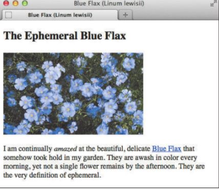


** 元素：描述网页不同部分的标签**

* 开始标签是放在一对尖括号中的元素的名称及可能包含的属性,结束标签是放在一对尖括号中的斜杠加元素的名称。

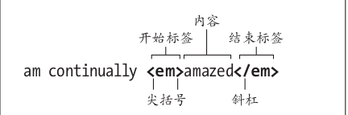

**最为常见的元素:**

* a ---- 链接

* article ---- 

* em ---- 斜体

* h ---- 标题

* img ---- 图片

* p ---- 段落

* label ---- 关联文本标签与表单字段，属性总是位于元素的开始标签内,属性的值通常放在一对括号中。

 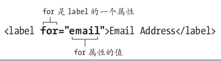

* 有的元素可以有多个属性,每个属性都有各自的值。属性的顺序并不重要。不同的属性 – 值对之间都用空格隔开。

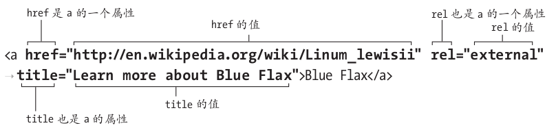

* 空元素 ---- 既不包含文本也不包含其他元素，像是开始标签和结束标签的结合,由左尖括号开头,然后是元素的名称和可能包含的属性,然后是一个可选的空格和一个可选的斜杠,最后是必有的右尖括号。

```javascript

                                                                   |
                                                       可选的空格和斜杠
```

	

* 数字值无需包含单位,只需输入数字本身。图像和视频的宽度和高度是有单位的,默认为像素。

    * 空元素(如这里显示的 img 元素)并不包含任何文本内容( alt 属性中的文字是元素的一部分,并非显示在网页中的内容)。空元素只有一个标签,同时作为元素的开始标签和结束标签使用。结尾处的空格和斜杠在 HTML5 中是可选的。元素最后面的 > 是必需的。
    
** 有的属性只接受特定的值。**

 * 有的属性可以接受任何值,有的则有限制。最常见的还是那些仅接受预定义值(也细说明,不过不妨先看看都有哪些类型的值。称为枚举值)的属性。也就是说,必须从一个标准列表中选一个值。一定要用小写字母编写枚举值。
 
    * href 属性和 title 属性那样可以输入任意值

   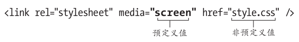

* 需要设置为数字的属性的值,尤其是描述大小和长度的属性。其中的数字值无需包含单位,只需输入数字本身。

* 用于引用其他文件的的属性(例如 href 和 src ),只能包含 URL(统一资源定位符,是万维网上文件的唯一地址)形式的值。

* 布尔属性比较特殊的是值是可选的,只要这种属性出现就表示其值为真。如果一定要包含一个值,就写上属性名本身。布尔属性也是预先定义好的,无法自创。
```javascript
<input type="email" name="emailaddr" required />
											|
										布尔属性
```
>这段代码提供了一个让用户输入电子邮件地址的输入框，布尔属性 required 代表用户必须填写该输入框。布尔属性不需要属性值,如果一定要加上属性值,则写作 required="required".


**父元素和子元素**

* 如果一个元素包含另一个元素,它就是被包含元素的父元素,被包含元素称为子元素。子元素中包含的任何元素都是外层的父元素的后代。这种类似家谱的结构是 HTML 代码的关键特性,它有助于在元素上添加样式和应用 JavaScript 行为。

* 值 得 注 意 的 是, 当 元 素 中 包 含 其 他 元素 时, 每 个 元 素 都 必 须 嵌 套 正 确, 也 就 是子 元 素 必 须 完 全 地 包 含 在 父 元 素 中。 使 用结束标签时,前面必须有跟它成对的开始标签。换句话说,先开始元素 1,再开始元素 2,就要先结束元素 2,再结束元素 1。

```javascript

<article>
	<h1>The Ephemeral Blue Flax</h1>
	
<p>...continually <em></em>...delicate <a...>Blue Flax</a>...</p>

</article>

```
>article 元素是 h1 、 img 和 p 元素的父元素。反过来, h1 、 img 和 p 元素
是 article 元素的子元素(也是后代)。 p 元素是 em 和 a 元素的父元素。 em 和 a 元素是 p 元素的子元素,也是 article 元素的后代(但不是子元素)。反过来, article 元素是它们的祖先;

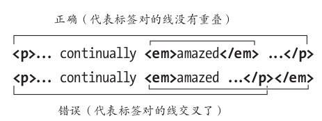

>元素必须正确地嵌套。如果先开始 p ,再开始 em ,就必须先结束 em ,再结束 p；


##### ** 网页的文本内容**

* 浏览器呈现 HTML 时,会把文本中的多个空格或制表符压缩成单个空格,把回车符和换行符转换成单个空格,或者将它们一起忽略.

* HTML 过去只能使用 ASCII 字符。ASCII只包括英语字母、数字和少数几个常用的符号。开发人员必须用特殊的字符引用来创建重音字符和许多日常符号。如 & eacute; ( 表 示 é )、& copy; ( 表 示 ©) 等,详情点击==>[特殊字符完整列表](www.elizabethcastro.com/html/extras/entities.html)

* <p style="color:red">以下页面中的文本内容(粗体部分)几乎就是标签以外的所有东西。</p>注意每个句子都至少包含一个回车符,有的词之间隔了好几个空格(说明了 HTML 如何处理回车符和空格)。第二段还包含一个表示版权符号的特殊字符引用( &copy; )

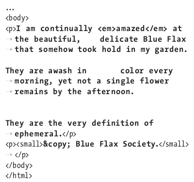


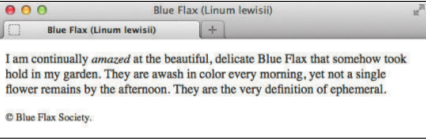
 
 >文档预览时，多余的回车和空格都被忽略了,字符引用也替换成了
对应的符号(©)

#####** Unicode 极 大 缓 解 了 特 殊 字 符 问 题。**

* 用UTF-8 对页面进行编码,并用同样的编码保存 HTML 文件是一种标准做法。

	* 直接在 head 开始标签后面指明文档的字符编码。 charset 属性用来设置编码类型(通常为UTF-8)
```javascript
<!DOCTYPE html>
<html lang="en">
<head>
	<meta charset="utf-8" />
	<title>Blue Flax (Linum lewisii)</title>
</head>
<body>
...
</body>
</html>
```

#### ** 网页文件命名**

1. ** 文件名全部使用小写字母。**

2. ** 使用正确的拓展名,通常使用的是 .html。**

3. ** 用短横线分隔单词，不要在文件名和文件夹名中使用空格分隔单词**。 应该使用短横线, 例如 company-history.html 和 my-favorite-movies.html。

	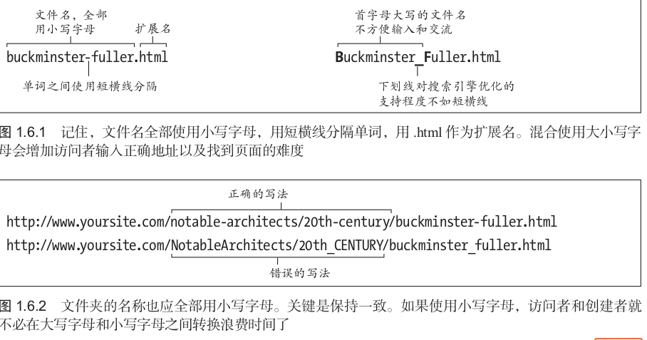
    
## ** URL**
URL(Uniform Resource Locator,统一资源定位符)是<em style="color:red">地址</em>的别名。互联网上的每个文件都有唯一的 URL。

* URL 的第一个部分称为模式(scheme)。 模式告诉浏览器如何处理需要打开的文件。
	* 最 常 见 的 模 式 是 HTTP(Hypertext Transfer Protocol,超文本传输协议)
   
	* HTTPS 是 从 HTTP 衍 生来的,用于电子商务网站等安全网页。它的格式同 HTTP 一样,只是用 https 替代了 http。

	 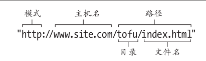
		> -基本的 URL 包含模式、主机名称和路径。路径包含一个或多个目录(文件夹),最后是一个文件名.

* URL 路径不以文件名结尾,而以一个目录结尾(可以包含一个结尾的斜杠,也可以不包含)。在这种情况下,URL 指的是路径中最后一个目录中的默认文件,通常为** index.html**。(通常情况下,所有 Web 服务器的配置都将 index.html 作为默认文件名,因此你不必修改任何服务器配置。)

	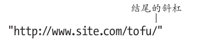

    >以一个斜杠而非文件名结尾的 URL 指向最后一个目录(在这个例子中是 tofu 目录)中的默认文件。最常见的默认文件名是 index.html。

* 其 他 常 见 的 模 式 有 用 于 下 载 文 件 的 ftp(File Transfer Protocol,文件传输协议)

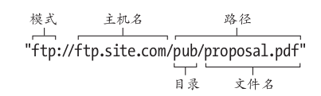

>当用户点击这个 URL 时,浏览器会开始按 FTP 模式传输文件 proposal.pdf

* 用于发送电子邮件的 mailto

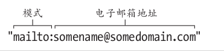

>用于电子邮件地址的 URL 包括 mailto 模式,紧接着是一个冒号(没有斜杠),然后是电子邮箱地址本身.

*  最常用到的是 http(也包括 https),其次是 mailto,再次是 ftp。

*  <p style="color:red">模式后面通常紧跟一个冒号和两个斜杠。</p>mailto 是个例外,它后面只有一个冒号


** 1. 绝对 URL**

* 绝对 URL(absolute URL)包含了指向目录或文件的完整信息,包括模式、主机名和路径.(绝对 URL 本身与被引用文件的实际位置无关,无论是在哪个主机上的网页中,某一文件的绝对 URL 都是完全一样的。)


* 对于 FTP 站点以及几乎所有不使用 HTTP协议的 URL,都应该使用绝对 URL。

** 2. 相对 URL**

* 相对 URL 以包含 URL 本身的文件的位置为参照点,描述目标文件的位置。因此,相对 URL 可以表达像“指向本页面同一目录下的 xyz 页面”这样的意思。


* ** 引用同一目录下的文件**
	* 如果目标文件与当前页面(也就是包含URL 的页面)在同一个目录中,那么这个文件的相对 URL 就只有文件名和扩展名。
   
		* 例如，链 接 的 HTML 可 能 是 < ahref="history.html">Take me to history.html!< /a> 。

		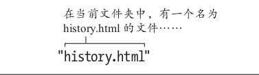

        >相对 URL 指向同一目录下的文件。URL 中只需要文件名和扩展名,不需在前面加上 http://www.site.com/about/(文件所在的主机名和目录)

* ** 引用子目录下的文件**

	* 如果目标文件在当前目录的子目录中,那么这个文件的相对 URL 就是子目录名,接着是一个斜杠,然后是文件名和扩展。
   
		* 例 如, < a href="info/data.html">Data supports my hypothesis< /a> 。

		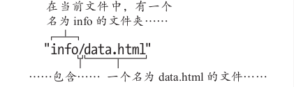

        >要引用当前文件夹的子文件夹中的文件,在这个例子中是 data.html,应在文件名之前加上子文件夹名称和一个斜杠。

* ** 引用上层目录的文件**

	* 如果要引用文件层次结构中更上层目录中的文件,那么应该使用两个句点和一个斜杠。

		* 例 如, < a href="../products.html">our products< /a> 。每个 ../ 都表示“到当前文件的上一层”,因此, ../../会向上走两级, ../../../ 会向上走三级。
    
		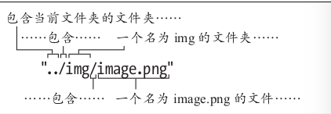

        >使用两个句点和一个斜杠上升一级,然后指出子目录(img),再跟一个斜杠,最后是文件名(实践中,可以为image.png 选择一个更具描述性的文件名,这里的名称仅作为示例)

* ** 根相对URL **

	* 在web服务器下输入文件路径时，可以直接在最开始使用斜杠。

	* 根 相 对 URL 就 是 /img/family/vacation.jpg(假定 img 文件夹位于网站的根文件夹,这也是惯常的用法)

	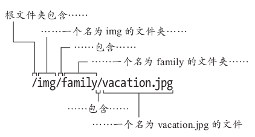

    >相同的根相对 URL 可用于所有的页面,不管页面在网站目录结构中的具体位置。

* ** 绝对 URL 和相对 URL 的比较**
	                      
| |绝对 URL 和相对 URL ||
| :-------- |: ----------: | :--------: |
|文件名 |URL(可以在任何地方使用)|  相对 URL(只能在 you-are-here.html 中使用)|
|history.html| http://www.site.com/about/history.html |history.html
|data.html| http://www.site.com/about/info/data.html |info/data.html
|image.png| http://www.site.com/img/image.png| news.html 
|news.html| http://www.remote.com/press/news.html |(无,使用绝对 URL)
|join.html| http://www.remote.com/sign-up/join.html |(无,使用绝对 URL)

描述了从 you-are-here.html 访问各个不同文件的方式,这些文件有的位于同一个网站(www.site.com),有的位于另一个网站(www.remote.com)。尽管表格的前三行也可以使用绝对 URL,但访问同一网站的文件时最好使用相对 URL。

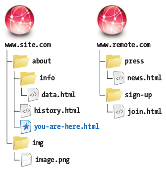

上图显示了两个网站的文件和目录结构,包 含 URL 的 文 档( 在 这 个 例 子 中 是you-are-here.html)是相对 URL 的参照点。换句话说,相对 URL 是相对于这个文件在服务器上的位置。绝对 URL 与其所在的位置无关,因为它们总是包含资源的完整 URL。

