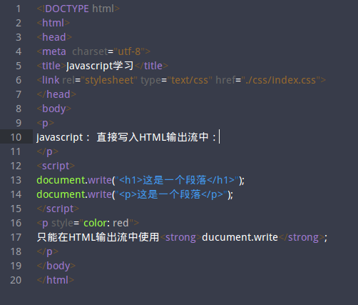

### Javascript学习记录

学习资料：[JavaScript 菜鸟教程](http://www.runoob.com/js/js-intro.html)

* < script>< /script>开始（结束）标签用于存放HTML脚本中的Javascript,也可放置在< body>和 < head>标签中，或者同时存在与两个部分中，浏览器会解释并执行标签中的代码；

* 将函数放入< head>部分中，或页面底部。（这样安置在同一个位置不会干扰页面内容）

** 一、直接写入HTML**

document.write("< h1>这是一个标题< /h1>")；

document.write("< p>这是一个标题< /p>");

** 1、在sublime中，写入程序**

```
<!DOCTYPE html>
<html>
<head>
<meta  charset="utf-8">
<title>Javascript学习</title>
<link rel="stylesheet" type="text/css" href="./css/index.css">
</head>
<body>
<p>
javascript： 直接写入HTML输出流中：
</p>
<script>
document.write("<h1>这是一个段落</h1>");
document.write("<p>这是一个段落</p>");
</script>
<p style="color: red">
只能在HTML输出流中使用<strong>document.write</strong>;
</p>
</body>
</html>
```



* 保存后单击右键，选择“Open in Brownser”在浏览器中运行，得到


** 2、接着在存放文件的同一个文件夹下，新建一个名为“css”的文件夹，再新建一个名为“index.css”的文件，使用sublime打开该文件开始编辑，用< h1>标签举例：**

* 输入

```
h1
{
	color：blue；
}
```

** 保存更改后运行文件;**


* ** 按照上一步所述的方法重新运行，< h1>标签中的样式已经更改；**


** 3、在< body>中加入Javascript函数，还是在sublime编辑器中编写一个HTML文件，新建一个文件（后缀名.html），编入一下程序：**

```
<!DOCTYPE html>
<html>
<head>
	<meta charset="utf-8">
	<title>我的web页面</title>
</head>
<body>
	<h1>我的web页面</h1>
	<p id="demo">这是我的web页面</p>
	<button type="button" onclick="myFunction()">尝试一下</button>
<script >
	function myFunction()
	{
		document.getElementById("demo").innerHTML="我的第一个Javascript 函数"
	}
</script>
</body>
</html>
```


* 然后运行得到一下：


* 然后单击“尝试一下”，变成


** 二、在HTML中引入.js文件**
** 1、首先随便输入一段JavaScript代码，并保存为.js文件，文件名为“helloWord.js”**

```
document.write("<p>HELLO WORD</p>");

```

** 2、在新建一个文件输入一段HTML代码，然后讲.js文件插入在< script>标签中，文件与.js文件保存在同一路径下，在同一路径下时，直接在< script>标签中加入文件名，若不一致则在引用时设置添加路径**，如/home/JS/helloword.js

```
<!DOCTYPE html>
<html>
<head>
</head>
<body>
<h1>这是一个标题</h1>
<script type="text/javascript" src="helloword.js"></script> 
				// 不在同一文件夹内时输入路径 /home/JS/helloword.js
     	 //<script>标签中的type属性可有可无，因为默认就是JavaScript语言；
</script>
</body>
</html>
```

* **在sublime中运行后，**


3、window onload ：在页面加载完成后出现一个提示框

```
window.onload=function ()
{
	alert ('a');
}
```


