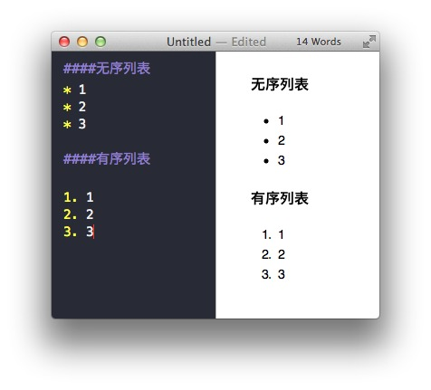
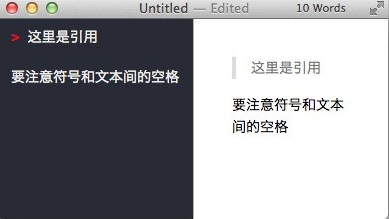
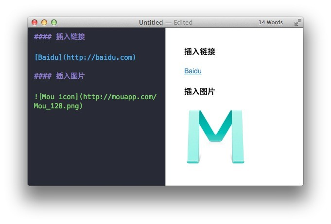

** 查阅markdown标记语言**

  Markdown使用规则

* 标题
标题是每篇文章都需要也是最常用的格式，在 Markdown 中，如果一段文字被定义为标题，只要在这段文字前加 # 号即可。

	* # 一级标题
	* ## 二级标题
	* ### 三级标题
	
以此类推，总共六级标题，建议在井号后加一个空格，这是最标准的 Markdown 语法。

* 列表

     列表的显示只需要在文字前加上 - 或 * 即可变为无序列表，有序列表则直接在文字前加 1. 2. 3. 符号要和文字之间加上一个字符的空格。 要注意的是 前后都要有空行：
     


* 引用

     在文本前加入 > 这种尖括号（大于号）即可



* 图片与链接

	插入链接与插入图片的语法很像，区别在一个 !号
	插入图片的地址需要图床，生成URL地址即可。
	注意：图片必须与需插入的文件在同一文件夹内；



* 粗体与斜体

   Markdown 的粗体和斜体用两个 * 包含一段文本就是粗体的语法，用一个 * 包含一段文本就是斜体的语法。
     例如：**这里是粗体**    *这里是斜体*

* 居中和对齐
< center  >居中< /center  > 
< h5 style="text-align:right">右对齐< /h5>
< h5 style="text-align:left">左对齐< /h5>
或者
居中
< center>居中</ center>

<center>居中</center>

左对齐：
< p align="left">左对齐< /p>

<p align="left">左对齐</p>

右对齐：
< p align="right">右对齐< /p>

<p align="right">右对齐</p>

* 换行符

   姓名|爱好|
    --|--|
     张三|足球<br>篮球

	李四|羽毛球<br>乒乓球

	显示为：
	姓名
	爱好
	张三
	足球
	篮球
	李四
	羽毛球
	乒乓球


* 表格

标题 | 标题 | 标题
------- | ------- | -------
单元格   |  单元格   |  单元格
单元格   |  单元格   |  单元格

##### 还可以添加一些边框：

| 标题 | 标题 | 标题 |
| ------- | ------- | ------- |
|   单元格  |   单元格  |   单元格  |
|   单元格  |   单元格  |   单元格  |

你可以控制单元格的对齐方式：

标题 | 标题 | 标题
:----- | :----: | ------:
左   | 中 | 右
左   | 中 | 右

例子如下：
| Tables  | Are       | Cool  |
| ------------- |:-------------:| -----:|
| col 3 is      | right-aligned | $1600 |
| col 2 is      | centered      |   $12 |
| zebra stripes | are neat      |    $1 |
     这种语法生成的表格如下：

| Tables  | Are       | Cool  |
| ------------- |:-------------:| -----:|
| col 3 is      | right-aligned | $1600 |
| col 2 is      | centered      |   $12 |
| zebra stripes | are neat      |    $1 |

* 代码框

     如果需要在文章里引用代码框，在 Markdown 下实现，只需要用两个 ` 把中间的代码包裹起来。图例：

     使用 tab 键即可缩进。


* 分割线

     分割线的语法只需要另起一行，连续输入三个星号 *** 即可。

* 文本样式
（带“*”星号的文本样式，在原版Markdown标准中不存在，但在其大部分衍生标准中被添加）
	* 链接 :[Title](URL) [Title] (URL)
	* 加粗 :**Bold** 
	* 斜体字 :*Italics* 
	* *删除线 :~~text~~ (~~ text~~)
	* *高亮 :==text== = =text==
	* 段落 : 段落之间空一行
	* 换行符 : 一行结束时输入两个空格
	* 列表 :* 添加星号成为一个新的列表项。
	* 引用 :> 引用内容
	* 内嵌代码 : `alert('Hello World');`
	* 画水平线 (HR) :-------- (- - - - - - - -)


* 图片

使用Markdown将图像插入文章，你需要在Markdown编辑器输入  。 这时在预览面板中会自动创建一个图像上传框。你可以从电脑桌面拖放图片(.png, .gif, .jpg)到上传框, 或者点击图片上传框使用标准的图像上传方式。 如果你想通过链接插入网络上已经存在的图片，只要单击图片上传框的左下角的“链接”图标，这时就会呈现图像URL的输入框。想给图片添加一个标题, 你需要做的是将标题文本插图中的方括号，e.g;![This is a title] ().

* 代码框

```
aler(这是一个代码框);
```

** 注：**
* 先输入标题行，回车后在第二行输入|-后，按tab键就将进入Table编辑模式。
* 表格必须与前面输入的文字之间有空行，否则表格会被当成普通文字渲染。


具体使用Sublime Text编写Markdown：
[markdown使用教程1（参考）](http://blog.csdn.net/qazxswed807/article/details/51235792)

[markdown使用教程2（参考）](http://www.appinn.com/markdown/)
