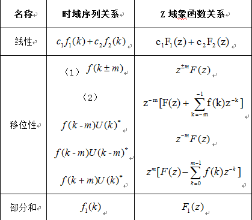
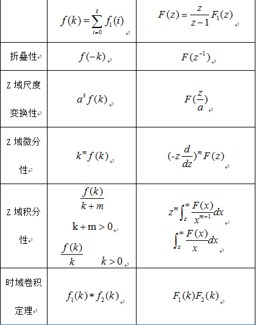
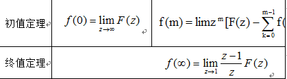
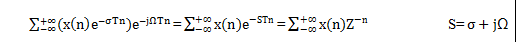
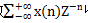

|课题:|**Z变换**||
|:--|:--:|--:|
|              | 1. 了解的内容: Z变换基础函数              |||
|			   | 2. 熟悉的内容: Z变换的性质定理         |||
| ** 教学目标：**  | 3. 识记的内容: 傅里叶级数展开与Z变换      |||
|			   | 4. 应用的内容: 傅里叶变换与拉氏变换       |||
|			   | 5. 拓展的内容: 傅里叶级数展开与傅里叶变换 |||
| ** 教学重点: **  |    傅里叶级数展开与Z变换                  |||
|  **教学难点：**  |    Z变换的性质定理                        |||
|  ** 课程类型：** |    讲授课 | ** 教学方法：**  |      讲授     |
| ** 课前准备：**  |            教案、PPT                      |||
|**教学过程及时间分配: **  |         主 要 教 学 内 容    1. 使用ztrans,iztrans函数分别求出离散时间信号的Z|||
|**1. z变换基础函数：**|习惯,有利于对函数的理解。复习MATLAB的基本应用，如：help,可|||
|                |以帮助查询相关的函数的使用方法,巩固理论知识中的离散时间信|||
|                |号的传递函数与二次项式之间的转换，以及使用zplane函数画出相|||
|                |关系统的零极点分布图,根据零极点的分布情况估计系统的滤波特性|||
||**Z变换的性质定理：**|||
|||||
|傅里叶级数展开与Z变换：|对与傅里叶级数展开而言，一般周期信号的频谱都具有离散型，谐波性和收敛性，但如果一个周期信号的频谱不收敛，我们要将它从时域移到频域上就要将原始信号频谱乘上一个衰减信号将其变为收敛的再做傅里叶级数展开，有即为Z变换，如令σ=0即Z=1，则Z变换就变成了傅里叶级数展开，所以傅里叶级数展开是Z域仅在单位圆上取值的Z变换，Z变换是傅里叶级数展开的推广。对于给定的序列x(n),使级数收敛的Z平面中的区域称为其收敛域。采样定理是连接连续时间信号和系统与离散时间信号和系统的桥梁，以上三个变换均满足线性性质，即迭加性和齐次性。|||
|拉氏变换与Z变换|对于离散的时间信号和系统而言，我们对理想取样信号表达式两边进行拉氏变换，再以Z=e^sT代入可得Z变换的表达式X(Z)=∑_(-∞)^(+∞)▒[x(n)Z^(-n) ],所以从理想取样信号的拉氏变换到Z变换，就是由复变量S平面到复变量Z平面的映射变换，映射关系为 Z=e^sT，可见Z变换也可以看做是取样信号拉氏变换的一种特殊情况，此时S=σ+jω，t=n T,ω=ΩT,则Z变换可看作是针对离散的信号和系统的拉氏变换，由Z=e^sT =e^σT e^jΩT中可以看到σ=0时，Z是一个半径为1只有相位的函数，故Z域可用极坐标描述，S域上的虚轴对应Z域上的单位圆，当σ<0时，Z的幅值小于1，即S域上虚轴的左边对应Z域的单位圆内，反之，S域上虚轴的右边对应Z域的单位圆外。|||
|傅里叶变换与拉氏变换|上述的傅里叶变换必须是在一个信号满足绝对可积的条件下才成立，那么对于不可积的信号，我们要将它从时域移到频域上，就要将原始信号乘上一个衰减信号将其变为绝对可积信号再做傅里叶变换，即为              ∫_(-∞)^( ∞)▒〖（f(t) e^(-σt) ） e^(-jωt) 〗 dt=∫_(-∞)^( ∞)▒〖f(t)e^(-(σ+jω)t) dt〗=∫_(-∞)^( ∞)▒〖f(t)e^(-st) 〗 dt         s=σ+jω  变为拉氏变换，如令σ=0则拉氏变换就变成了傅里叶变换，所以傅里叶变换是S域仅在虚轴上取值的拉氏变换，拉氏变换是傅里叶的推广，拉氏变换的收敛域就是f(t) e^(-σt)满足绝对可积条件的σ值的范围，在收敛域内可积，拉氏变换存在，在收敛域外不可积，拉氏变换不存在。拉氏变换针对于连续时间信号，主要用于连续时间系统的分析中，对一个线性微分方程两边同时进行拉氏变换，可将微分方程转化成简单的代数运算，可方便求出系统的传递函数，简化了运算。|||
|傅里叶级数展开与傅里叶变换|之所以要将一个信号f(t)进行傅里叶级数展开或傅里叶变换是因为一般自然界信号都非常复杂，且表面上并不能直观的表现出频率与幅值的关系，而一个信号的大部分有效信息恰藏于其频谱上，即其幅频关系和相频关系上。通过傅里叶级数展开或傅里叶变换，可将自然界中复杂的信号分解成简单的，有规律的基本信号之和或积分的形式，并且可以明确表达出周期信号的离散频谱和非周期信号的连续频谱函数。   傅里叶级数展开是对于周期信号而言，如果该周期信号满足狄利克雷条件（在电子和通讯中大部分周期信号均满足），周期信号就能展开成一组正交函数的无穷级数之和，三角函数集在一个周期内是完备的正交函数集，使用三角函数集的周期函数展开就是傅里叶级数展开，而欧拉公式是将三角函数和复指数连接了起来，所以傅里叶级数可展开成三角函数或复指数两种形式，此时就可画出信号的频谱图，便可直观的看到频率与幅值和相位的关系。  既然是级数和展开，则上述频谱图中横轴表示n倍的角频率，是一个离散频谱图，那么由离散频谱的间隔与周期的反比关系知当f(t)的周期T趋近于无穷大时，周期信号变成了非周期信号，谱线间隔趋近于无穷小，谱线无限的密集而变成为连续频谱，该连续频谱即为频谱密度函数，简称频谱函数，该表达式即是我们熟悉的傅里叶变换，傅里叶变换将信号的时间函数变为频率函数，则其反变换是将频率函数变为时间函数，所以傅里叶变换建立了信号的时域与频域表示之间的关系，而傅里叶变换的性质则揭示了信号的时域变换相应地引起频域变换的关系。||||

