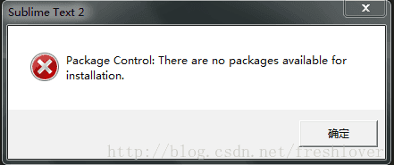
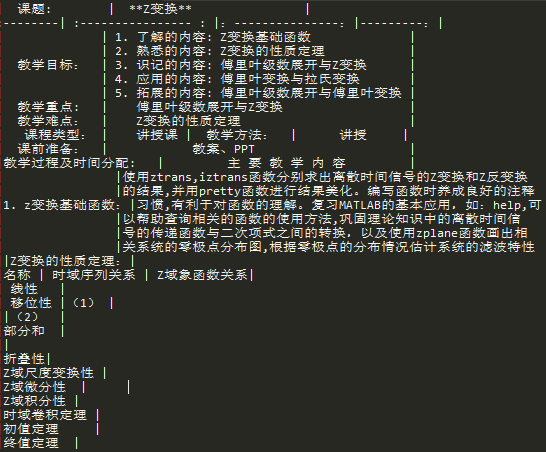
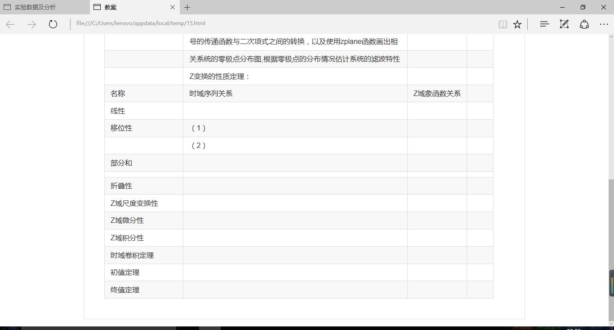
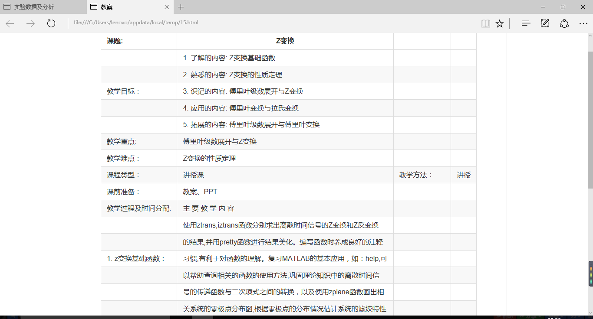
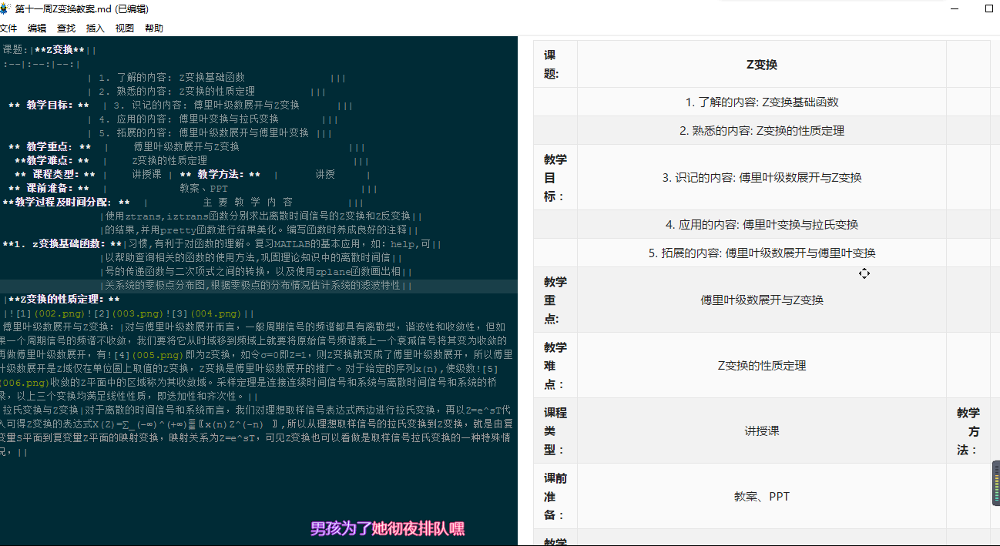
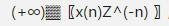

** 一. 实验名称：Z变换教案**

** 二. 实验目的：使用markdown制作z变换教案**

** 三. 实验器材：电脑、程序编辑器 SublimeText 和 Haroopad 及“z变换教案”文档一份**

** 四. 实验过程：**通过在Sublime Text安装Markdown插件来进行对z变换教案的编辑，实验过程中熟悉了关于Sublime Text 的Packcage Control的安装，以及探究markdown插件中markdown preview和markdown editting的安装，尝试Markdown标记语言的用法，再将markdown（md）.文件转化为html.文件再网页中进行预览;

** 五. 实验数据及分析：**

** 安装关于markdown插件:**

** 1. 安装Package Control. **

  - ctrl+shift+P输入install进入install Packages

  -  ** ctrl+` 打开控制台，拷贝下面的代码运行：**
     * import urllib2,os; pf='Package Control.sublime-package';ipp = sublime.installed_packages_path(); os.makedirs( ipp ) if not os.path.exists(ipp) else None; urllib2.install_opener( urllib2.build_opener( urllib2.ProxyHandler( ))); open( os.path.join( ipp, pf), 'wb' ).write( urllib2.urlopen( 'http://sublime.wbond.net/' +pf.replace( ' ','%20' )).read()); print( 'Please restart Sublime Text to finish installation') *

  - 输入markdown preview（支持设置markdown语法，直接生成html进行预览等功能)
  	* 按CTRL + B生成网页HTML
  - 输入markdown editting(除了高亮显示语法，MarkdownEditing 还提供了一些快捷键用于快速插入markdown 标记)
  	* 在Preferences ->Color Scheme找自己喜欢的主题
    如：插入链接：Ctrl + Win + K
	    插入图片：Shift + Win + K

 - 自定义快捷键：点击 Preferences --> 选择 Key Bindings User，输入：
	{ "keys": ["alt+m"], "command": "markdown_preview", "args": {"target": "browser", "parser":"markdown"} }
   * 保存后，直接输入快捷键：Alt + M 就可以直接在浏览器中预览生成的HTML文件了。

    重启软件测试：ctrl+shift+P 输入install paclage 调出Install package包验证是否成功
    测试在sublime text 中可以直接ctrl+shift+p 输入install package 安装package Control

	参考网页：

    [Package Contro插件安装1](http://blog.csdn.net/qazxswed807/article/details/51235792)

	[Package Control插件安装2](http://www.cnblogs.com/angel-1314/p/6123717.html)

 ** (1). 在安装markown插件时，ctrl+shift+p操作后输入install出现无法安装插件的问题，解决过程如下：**

	* 错误提示："Package Control：There are no packages available for installation"

	 

   参考网页： [Markdown Control插件安装3](http://blog.csdn.net/freshlover/article/details/44261229/)
   （Intent服务提供者（ISP）不支持IPv6就会引发上述错误）

  	 按照资料中的提示进行反复修改，并没有解决此问题。

** 2.执行上诉操作后问题仍未解决，于是尝试重新下载 Sublime text软件. **

** (1). 使用Google Chrome在Sublime Text官网中重新download后根据上述过程重复操作:**

* **无法安装插件问题解决；**

* Ctrl+~后在控制台中输入代码并运行显示Package Control安装完成，之后按照之前的操作安装markdown preview和markdown editting插件，安装完成后可以在Sublime Text中编写Markdown语句,再CTRL + B生成网页HTML，最后 Alt + M 就可以直接在默认浏览器中预览生成的HTML文件了。

* **输入代码及生成的预览文件如下：**

	

***3.出现如下错误：***

**(1). 无法插入图片；**

* 解决方法:
     在基础语法的括号中填入图片的位置路径即可，支持绝对路径和相对路径。

 输入“ ! [‪错误提示1] (000.png) ”

*(错误如上图所示) *

 * 按照网页上的相关教程，进行操作均未显示出图片(如上图),问题有待解决。

  	在基础语法的括号中填入图片的位置路径即可，支持绝对路径和相对路径。

  	按照网页上的相关教程，进行操作均未显示出图片(如上图),问题有待解决。

 * 参考网页： [插入图片参考](https://www.zhihu.com/question/21065229)

** (2). 转换表格形式时，经常出现文字形式，查找相关问题后得出结论：**

 * 表格必须与前面输入的文字之间有空行，否则表格会被当成普通文字渲染。

** (3). 引用列表时，无法转换；**

 * 表的显示只需要在文字前加上 - 或 * ，注意的是 前后都要有空行；

** (4). 调试过程中点击“view”->“hide menu”，导致主菜单隐藏：**

 * 按住Ctrl+Shifp+p,出现一个框，在框里输入“view:”，出现了如下界面：

 * 选择：“View:Toggle Menu”即可。

**4. 编写至以上内容，重新下载使用新的程序编辑器 Haroopd；**

 (1). 使用Google Chrome 进入 Haroopad官网下载根据提示完成安装后自动显示为中文版.
 (2). 将Sublime Text中原有的代码复制粘贴到新建的程序编辑器 Haroopad文件中，正常显示无需调整格式.
 		
 (3). 尝试解决Sublime Text 中无法显示图片问题：

* 点击主菜单的 插入 ==> 图片

 	* 出现 ! [] (http://) 提示符，根据在Subime Text插入图片的教程中，尝试添加 ![图片名] (图片地址/文件名)，无法显示出图片：

    错误显示为：       
    
      

* 根据网上教程将图片文件与.md文件保存在同一个 Haroopad文件夹下新建的文件夹中；

* 重复上一步操作插入图片![图片名] (图片地址/图片文件名)，成功插入图片；

(4). 将“Z变换教案”word文件中带公式的表格截图并插入至“Z变换教案.md"中

(5).继续复制粘贴后，文本中出现公式无法在.md文件中正确显示，

   * *错误如下图所示： *

      

* < img src="http://chart.googleapis.com/chart?cht=tx&chl= X(\Z) = \frac +∞ -∞ \ (x(n)Z^{-n}" style="border:none;">
* X(Z)=∑_(-∞)^(+∞)▒〖x(n) Z^(-n) 〗
根据查找的资料列出以下公式：X(\Z) =  \sum +∞ -∞ \ x(n) z^(-n)
	* 无法显示公式

#####*参考文献：*
1. 帮助 ==>Markdown语法帮助；
2. http://blog.csdn.net/kamidox/article/details/48380239
3. http://blog.csdn.net/xiahouzuoxin/article/details/26478179
4. http://www.ituring.com.cn/article/32403September 12, 2017 7:51 PM

(6). 尝试在表格中进行换行;

* 直接按Enter键，导致文字脱离表格外显示；

*  根据之前资料加入< br >,成功换行；

	

(7). 将本文中的链接使用超链接替换；
	插入===>超链接

   * [超链接名称] (http://网址)

(8). 将markdown文件转换为pdf文件

* 利用Markdown Preview的Preview in Browser功能可以在浏览器上看到htm效果。在页面右键->打印->另存为pdf->调节页边距即可将pdf文件下载下来。

**六、实验总结**
学习 Markdown语言时希望能够完整的将“Z变换教案”编写并呈现出来，但由于网络资源的限制，并没有找到能够解决Markdown语言问题的资料和方法，所以在实验过程中仍然存在一些没有解决到位的问题，例如公式的插入等等，在之后的学习中会继续补充并加以完善。

